# 03 · The GitHub-Powered Pipeline — the factory in motion (fleet mode)

> Deliverable 3. One intent on `{{DEMO_APP}}`, traced through the whole harness as it fans out into
> parallel units and back in. Phases, agent names, the 🟩/🟦/🟨 labels, the enforcement tiers, and the
> traceability chain are frozen in [`00-canon-and-variables.md`](./00-canon-and-variables.md); the
> agents are defined in [`02`](./02-agents-skills-harness.md); the drop-in artifacts are in
> [`harness/`](./harness/).

> 📌 **CALL-OUT — the worked intent (set to `{{DEMO_APP}}`).** Throughout this walkthrough the intent
> is: *"Add rate limiting to `{{DEMO_APP}}` so a single client can't exhaust the service."* Example
> default `{{DEMO_APP}}`: a small REST API service. Replace with the target repo's real service
> boundary; the *flow* is identical regardless of app.

---

## The pipeline at a glance

```mermaid
flowchart LR
  I([intent]) --> A
  subgraph A[PHASE A · PLAN  · sequential]
    A1[Planning agent: Issues + DoD + dependency graph]
  end
  A --> B
  subgraph B[PHASE B · VALIDATE · HARD GATE]
    B1[Rubber-Duck stress-tests plan]
    B2{{HUMAN: approve plan}}
  end
  B --> C
  subgraph C[PHASE C · EXECUTE · fleet / parallel]
    C1[Dev agent · Issue 1 · PR]
    C2[Dev agent · Issue 2 · PR]
    C3[Dev agent · Issue 3 · PR]
    C4[per-PR: Quality + Security + Review gates]
    C5{{HUMAN: approve PRs · CODEOWNERS}}
  end
  C --> D
  subgraph D[PHASE D · INTEGRATE & DEPLOY · fan-in]
    D1[Merge queue + integration tests/evals]
    D2[Deploy to DEPLOY_TARGET + smoke + traffic]
    D3{{HUMAN: approve release · Environment}}
  end
  D --> T([deployment history · full traceability])
```



---

## Phase A — PLAN  *(human-led, sequential)*

| Stage | Human action | Agent | GitHub surface | Artifact | Verification |
|---|---|---|---|---|---|
| A1 | State the intent (one sentence) | **Orchestrator** *(human)* | Tracking **Issue** | Tracking Issue opened | — |
| A2 | Review scope | **Planning / Requirements** | **Issues / sub-issues**, **issue forms**, **Projects** | A **Work Plan**: child Issues each with **acceptance criteria + DoD + test/eval strategy**, plus a **dependency graph** | Self-check: each Issue independently testable |

> 📌 **Worked example** *(illustrative — swap for the client's `{{DEMO_APP}}`)*. The decomposition for the running intent:

| Issue | Unit | Parallel-safe? | Depends on |
|---|---|---|---|
| #1 | Rate-limiter middleware | ✅ yes | — |
| #2 | Configuration surface (limits per client/tier) | ✅ yes | — |
| #3 | Documentation + API reference update | ✅ yes | — |
| #4 | End-to-end integration test (limit enforced across instances) | ⛔ no | #1, #2 |

The parallel-safe units fan out together; the integration test is **ordered** behind its predecessors. This
graph is the contract the whole rest of the pipeline obeys.

---

## Phase B — VALIDATE  *(HARD GATE — before any implementation)*

| Stage | Human action | Agent | GitHub surface | Artifact | Verification |
|---|---|---|---|---|---|
| B1 | — | **Rubber-Duck / Plan-Validation** | Issue comment + **plan-approval label** (+ optional merge-time check) | A verdict: PASS or required revisions | The validation **is** the verification (up-front) |
| B2 | ⛔ **Approve the plan** | **Orchestrator** *(human)* | Issue approval / check | Approved, frozen plan | Human judgment on a stress-tested plan |

What the Rubber-Duck attacks on the worked intent: *"What happens to in-flight requests at the
limit? Is the limiter store shared across instances, or will per-instance counters undercount? You
marked #4 dependent — good; but does #2's config schema need to land before #1 can compile against
it?"* If the last point is real, it **revises the graph** (an edge #1 → #2 appears) **before** any
agent runs. **No implementation begins until B passes and a human approves.** Enforcement here is
**orchestration discipline** (🟦) — the dispatcher only assigns Issues for an approved plan; GitHub
doesn't natively block pre-code work. This is the cheapest test in the pipeline and the one that
makes fan-out safe.

---

## Phase C — EXECUTE IN PARALLEL  *(fleet mode)*

| Stage | Human action | Agent | GitHub surface | Artifact | Verification |
|---|---|---|---|---|---|
| C1 | Dispatch the fleet (assign parallel-safe Issues, cap `{{FLEET_CONCURRENCY}}`) | **Orchestrator** → **Development fleet** | **Copilot coding agent** (concurrent: isolated env/branch/PR each) | One branch + one **linked PR** per Issue | 🟩 auto CodeQL + secret + dependency review + quality self-review on each PR |
| C2 | — | **Quality / Test** *(per PR, parallel)* | **Actions** matrix/concurrency (`tests-and-evals.yml`) | Tests **+ evals** as **required checks** | 🟩 Actions test jobs (content repo-owned) + 🟦 evals (trajectory + rubric/LM-judge) |
| C3 | — | **Security / Compliance** *(per PR, parallel)* | **GHAS** + `security-gate.yml` | Triaged findings, **Copilot Autofix**, supply-chain check, evidence | 🟩 CodeQL / secret / Dependabot gate |
| C4 | ⛔ **Approve each PR** | **Code Review** + human | 🟨 **Copilot code review** + **CODEOWNERS** required review | Review comments + docs/architecture-impact note | Required review (the AI pass is advisory) |
| C5 | — | **Development** *(dependent unit)* | Copilot coding agent | PR for **#4** opened **after** #1/#2 merge-ready | Waits per the dependency graph |

The parallel-safe Development agents run **at once**, each in its own sandbox, each opening its own PR. On every
PR, the Quality, Security, and Review gates run **concurrently**. The dependent unit (#4) is **not**
dispatched until its predecessors are ready — the graph from Phase A is **honored by the
orchestrator/dispatch automation** (🟦), not enforced natively by GitHub.

---

## Phase D — INTEGRATE & DEPLOY  *(fan-in)*

| Stage | Human action | Agent | GitHub surface | Artifact | Verification |
|---|---|---|---|---|---|
| D1 | — | **Orchestrator** (fan-in) | **Merge queue** + rulesets | Integrated `main` | 🟩 Actions integration-test jobs + 🟦 evals on the combined result |
| D2 | — | **Deployment / Validation** | **Actions** deploy + **Environments** (+ self-hosted runner option) | Deployment to `{{DEPLOY_TARGET}}` + smoke/traffic report | Smoke tests + synthetic traffic + health |
| D3 | ⛔ **Approve the release** | **Orchestrator** *(human)* | **Environment** protection rule | Released change + **deployment history** | Go/no-go on a green pipeline; rollback ready |

The parallel PRs **converge through the merge queue**, which integrates them one safe sequence at a
time and re-runs checks on each combined state — so three concurrently-built units don't silently
break each other on `main`. The Deployment agent ships, smoke-tests, generates synthetic traffic,
and reports go/no-go. Results post back to the plan/Issues/PRs, completing the trace.

---

## Subsection 1 — Fleet orchestration

**Decompose → fan-out → fan-in.** The orchestrator breaks the intent into the smallest **independent**
units that each map to one Issue, marks the **dependency graph** (parallel-safe vs. ordered), then
dispatches.

| Fleet concern | How it maps to GitHub |
|---|---|
| Fan-out | Assign **multiple Issues** to the Copilot coding agent at once → concurrent env/branch/PR each (🟩) |
| Parallel checks | **Actions matrix + concurrency** run test/eval/security jobs across many PRs (🟩) |
| Concurrency cap | Limit to **`{{FLEET_CONCURRENCY}}`** in-flight units (default in `00` §2) — a throughput/cost dial *(see Economics)* |
| Fan-in | **Merge queue** integrates many PRs safely, re-checking each combined state (🟩) |
| Dependency order | The graph; dependent units are **assigned later**, not in the first wave |
| Handoff (A2A) | 🟦 convention: Issues, sub-issues, PR links, labels, check outputs |

**Failure handling — what fleets must do beyond "run concurrently":**

| Failure mode | Response |
|---|---|
| **A Development agent fails / stalls** | Its PR simply doesn't go green; the orchestrator re-assigns the Issue or drops to **Conductor** mode in the IDE. Other units are unaffected — failures are **isolated per branch/PR**. |
| **Conflicting PRs** (two units touch shared code) | The **merge queue** serializes integration and re-runs checks; a conflict surfaces as a failed queued build, not a broken `main`. Root cause is usually a **decomposition miss** — feed it back to Phase B. |
| **Stale plan** (intent or code moved under the fleet) | The frozen plan + dependency graph are versioned on the Issue; if reality diverges, **re-validate** (Phase B) before continuing — never patch around a stale plan. |
| **Duplicate work** (two agents solve the same thing) | Prevented by one-Issue-per-unit assignment + linked PRs; caught early by the Review gate; a symptom of **overlapping decomposition** to fix in planning. |
| **Merge-order dependencies** | Encoded as graph edges; **dispatch automation** assigns dependent Issues only after predecessors are merge-ready. The **merge queue** then serializes and re-tests each merge so integration stays green — but it does **not** understand the semantic graph by itself; ordering is the orchestrator's job. |

The recurring theme: **most fleet failures trace back to a weak plan or a weak harness, not a weak
model** — which is why Phase B and `AGENTS.md` carry so much weight.

---

## Subsection 2 — Governance & traceability

**Where the human gates sit, and what actually enforces them:**

| Human gate | Enforced by (tier) |
|---|---|
| ⛔ Approve the **plan** (Phase B) | Human approval (label/comment) + **dispatch automation** (only approved plans fan out) — *🟦 layered orchestration gate; not native pre-code enforcement* |
| ⛔ Approve each **PR** (Phase C) | **Required reviews** + **CODEOWNERS** — *hard GitHub* |
| ⛔ Approve the **release** (Phase D) | **Environment** protection rules (required reviewers / wait timers) — *hard GitHub* |
| Quality / Security gates | **Required status checks** on the PR — *Actions-based → hard* |
| Safe integration | **Merge queue** + **rulesets / branch protection** — *hard GitHub* |

**The audit trail is a native byproduct** — the canonical **traceability chain** (from `00` §8):

```
intent → Issue (+ sub-issues) → Work Plan artifact → plan approval (label) + dispatch gate
       → agent branch → linked PR → status checks + evals → human review (CODEOWNERS)
       → merge queue → deployment + deployment history
```

Each arrow is a native link (with the plan-approval → dispatch step a **🟦 layered** one), so
reconstructing *"why does this line of production code exist?"* is
a matter of following references that already exist — **Actions logs, deployment history, security
overview, Copilot usage metrics** — not assembling a bespoke report.

> 🔒 **IF HIGH-ASSURANCE.** Tighten the gates rather than redesign them: make plan-validation and
> release approvals **multi-party** and logged; require **all** security + eval checks green before
> merge; split **Security / Compliance** into its own required gate; enable **secret-scanning push
> protection** and stricter **rulesets**; retain the traceability chain as your **evidence base** for
> audit. Same pipeline, stricter dials.

---

## Subsection 3 — Verification

Verification = **Tests + Evals**, and the **rubber-duck plan gate** is verification of *intent* before
any code exists.

- **Tests** — deterministic input → output; unit + e2e. The **native (🟩)** part is **GitHub Actions
  + required status checks**; the **test content is repo-owned**. Includes **regression suites** that
  must stay green.
- **Evals** (🟦 — a pattern, **not** a GitHub product) — implemented as **Actions jobs** running:
  **trajectory evaluation** (did the agent take the right steps / call the right tools?), **output
  rubrics / an LM-judge** (is the result good, not just present), and eval **regression** over time.
  Wired as **required checks**, they gate merge exactly like tests.
- **Plan validation** (Phase B) — the earliest and cheapest verification: it tests the *plan*, not
  the code.

*"Set the bar at the eval, not the demo."* A PR is mergeable when tests **and** evals are green — a
green demo proves nothing the eval suite hasn't already proven across cases.

---

## Subsection 4 — Maturity roadmap

| Stage | What you run | Adopt first |
|---|---|---|
| **Crawl** | **One** harnessed Copilot coding agent + a solid **`AGENTS.md`** + the platform's **built-in** validation (CodeQL/secret/dependency/quality self-review). **No fleet.** | Write `AGENTS.md`; assign single Issues; turn on required checks |
| **Walk** | Add **Quality** + **Review** as Agent Skills / sub-agents; a **small fleet** (low `{{FLEET_CONCURRENCY}}`); tests + evals as required checks; merge queue | Add the eval job; cap concurrency low; enable merge queue |
| **Run** | Full roster incl. **dedicated Security / Compliance**; larger fleet; automated **deploy + synthetic traffic**; tuned model routing | Split Security out; scale `{{FLEET_CONCURRENCY}}`; automate Phase D |

**Change-management implication:** maturity is a **harness** investment, not a model upgrade. Each
stage adds gates and context engineering, and the team's skill shifts from *writing code* to
*operating the factory*. Start at Crawl even if your model is state-of-the-art — the harness, not the
model, is what's missing.

---

## Subsection 5 — Economics

The business case is a **CapEx/OpEx** reframe:

- **Vibe coding = low CapEx / high OpEx.** Cheap to start; you pay later in token burn on rework, a
  maintenance tax on code nobody fully understands, and security remediation.
- **Agentic engineering = high CapEx / low OpEx.** You invest up front in the harness — rule files,
  agents, tests, evals, guardrails — and the per-change cost (and risk) drops.

**Levers that move OpEx:**

| Lever | Effect |
|---|---|
| **Intelligent model routing** | Premium models on planning/architecture/implementation; cheaper models on test/eval/review/CI monitoring *(see [`02`](./02-agents-skills-harness.md) Note C)* |
| **Context engineering** | High-signal, low-token payloads via **progressive disclosure** — cheaper *and* better than one bloated prompt; a direct financial lever |
| **`{{FLEET_CONCURRENCY}}`** | The **throughput ⇄ cost** dial: more parallel agents finish sooner but spend tokens concurrently. Raise it for urgency, lower it for cost control |
| **Plan validation** | The cheapest possible defect-catch — a bad plan caught in Phase B avoids N branches of wasted execution |

> 📌 **CALL-OUT.** The token economy runs on a shared budget; a single heavy agentic workload can
> dominate it. Compartmentalize and monitor agentic usage by team/use-case so fleet runs are visible.

---

## Subsection 6 — Honest limitations

Where this is **not** magic, and where humans stay accountable:

- **The 80% problem.** Agents nail ~80% of a feature fast; the last 20% — edge cases, integration,
  business-context correctness — needs human judgment. The gates exist to capture that 20%.
- **Configuration-failure mindset.** When an agent misbehaves, suspect the **harness** first (vague
  rules, missing tool, bloated context, absent gate) before blaming the model. Most failures are
  config failures.
- **Hallucinated dependencies / slopsquatting.** Agents can invent or mis-pin packages; the
  **Security / Compliance** gate's supply-chain check (Dependabot / Advisory DB) is non-optional, not
  a nicety.
- **Parallel-integration risk.** Concurrent units can collide. The dependency graph, the **merge
  queue**, and integration evals contain it — but a sloppy decomposition still produces conflicts the
  fleet can't paper over. Fix it in planning, not at merge time.
- **Where human judgment is mandatory.** Plan approval, PR approval, release approval — and any time
  the rubber-duck or a gate surfaces a question that needs domain context the agents don't have.
- **The honesty line.** Only 🟩 capabilities are GitHub products. **Evals** and **A2A** are 🟦
  patterns you build on the platform; **MCP** is a 🟨 integration point ("tools *can be* exposed via
  MCP"); **Copilot code review** and **Spaces** inform but **do not enforce** unless wired to required
  checks/reviews. Don't oversell the platform — the discipline is the product.

---

*Back to [`README`](./README.md) · [`00 Canon`](./00-canon-and-variables.md) ·
[`01 Story`](./01-story.md) · [`02 Agents/Skills/Harness`](./02-agents-skills-harness.md) · drop-in
[`harness/`](./harness/).*
